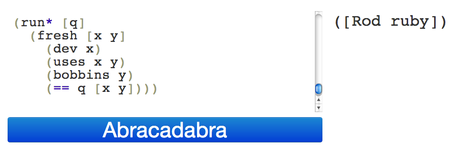

# Core Dot Logic Tool

Web tool for evaluating core.logic code.



## Usage

```
lein run
```

Then open your browser to http://localhost:1234/

## Disclaimer

This tools evals code server-side with little checking, it's
only meant to be a personal tool for playing/demoing.

I didn't do it all in ClojureScript as I needed facts/rels.

